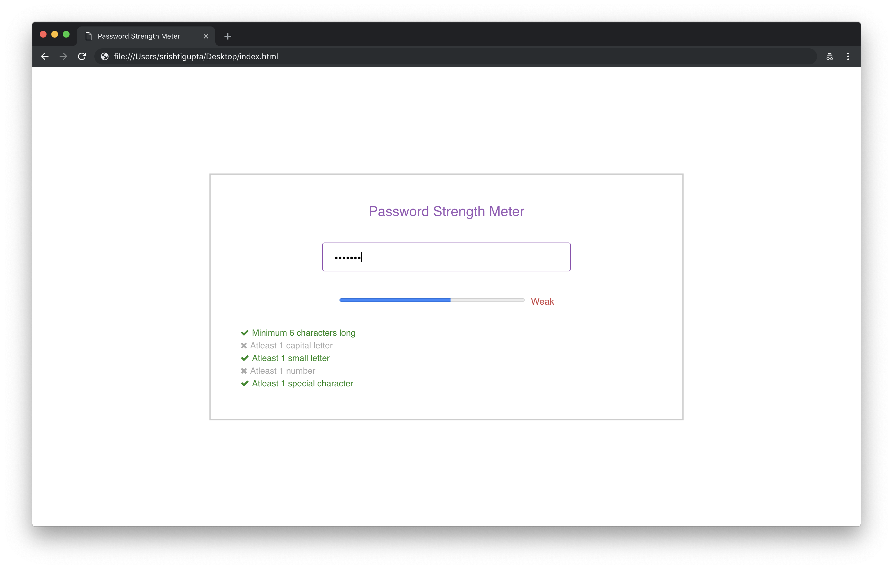

# Password Strength Meter

## Overview
>This is a web application created using ReactJS. It checks for the strength of the password input by the user. 

The strength of the password is based on the following criteria:
- The password should be **minimum 6 characters** long
- The password must have **atleast one capital letter**
- The password must have **atleast one small letter**
- The password must have **atleast one number**
- The password must have **atleast one special character** amongst **!@#$%^&*_**

A count is maintained which keeps track of the number of criteria met by the password input by the user. For each criterion satisfied, the user gets to see the check mark against it and the progress bar progresses by 20%. According to the count of the criteria met, the progress status is set. The progress status is changed as per the given rules:
- If the count is 0 or 1, then the progess status is set to **'Very Weak'**.
- If the count is 2 or 3, then the progress status is set to **'Weak'**.
- If the count is 4, then the progress status is set to **'Strong'**.
- If the count is 5, then the progress status is set to **'Very Strong'**.

This web application throws an error on the UI if any other character is entered and will not accept other characters except the ones mentioned earlier.

## Steps to run the application

1. Open the **index.html** file in your browser.
2. You will get to see the application, which looks like the screenshot given below.

